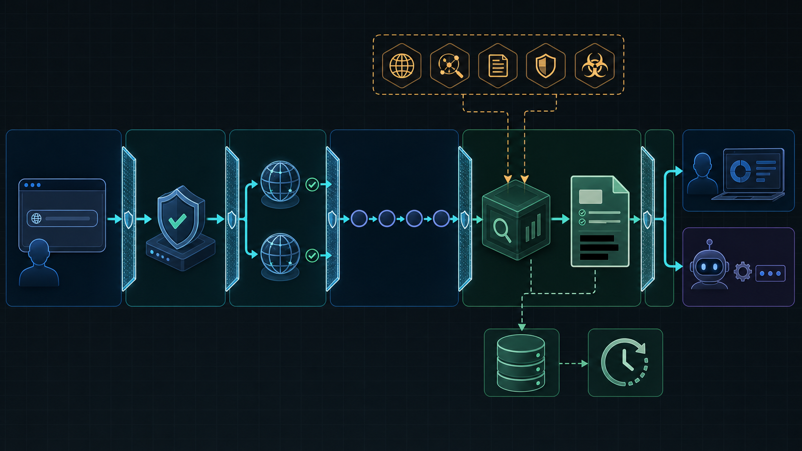
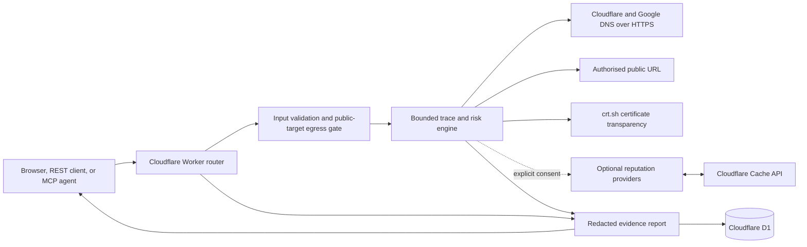

# RequestScope architecture

Last reviewed: 2026-08-22

RequestScope is a public URL tracing and risk-assessment service. It observes a URL from a Cloudflare edge location, records bounded DNS and HTTP evidence, derives explainable findings, and returns a privacy-redacted report to a browser, REST client, or MCP agent.

The infographic is a conceptual overview. The component and data-flow descriptions below are the technical source of truth.

## Product boundary

RequestScope answers: what did this edge observer see while resolving and requesting a public URL, and which risk indicators can be derived from that evidence?

It provides:

- public URL normalization and validation
- DNS observations and resolver agreement checks
- bounded manual redirect tracing
- selected HTTP metadata, security headers, page signals, and dependencies
- hostname, path, query, encoding, redirect, shortener, typo, lookalike, brand, and phishing-language indicators
- optional dependency and takeover evidence
- optional consented reputation checks
- low, medium, or high risk assessment with reasons and coverage
- shareable reports, JSON export, REST, NDJSON progress, OpenAPI, MCP, and Copilot metadata

A low score is an observation-based result. It does not certify a URL as safe.

## System context

## Runtime components

| Component | Responsibility | Primary source |
| --- | --- | --- |
| Worker router | Serves static assets, dispatches REST and MCP, applies CORS and response headers, rate controls, report retrieval, export, and scheduled cleanup | `api/src/index.ts` |
| Input security | Normalizes URLs, rejects unsafe schemes, credentials, IP literals, ports, and non-public targets | `api/src/security.ts` |
| Egress gate | Resolves through two providers, rejects mixed or reserved answers, follows redirects manually, and revalidates every hop | `api/src/egress.ts` |
| Request budget | Enforces whole-request subrequest, concurrency, byte, and elapsed-time limits | `api/src/budget.ts` |
| Trace analyzer | Captures redirects, selected response evidence, dependencies, page signals, and phase coverage | `api/src/analyzer.ts` |
| DNS engine | Collects named DNS record observations and resolver state | `api/src/dns.ts` |
| Dependency engine | Extracts and classifies bounded resource references and optional script evidence | `api/src/deps.ts`, `api/src/classifier.ts` |
| URL risk engine | Evaluates structure, brand similarity, typo and lookalike indicators, shorteners, message context, and phishing language | `api/src/url-risk.ts` |
| Reputation adapters | Calls consented external reputation providers and caches provider results | `api/src/reputation.ts` |
| Takeover evidence | Performs bounded DNS and provider-signature checks for discovered names | `api/src/takeover.ts` |
| MCP adapter | Publishes three typed tools over stateless Streamable HTTP | `api/src/mcp.ts` |
| Browser application | Submits scans, renders trace phases and evidence, handles consent, and displays reports | `web/app.js`, `web/index.html` |

## Trace and assessment flow

1. The caller submits a URL through the browser, REST, or MCP.
2. The Worker validates method, content type, request size, origin, and input schema before charging scan quota.
3. The URL is normalized. Credentials, IP literals, unsupported ports, and non-HTTP schemes are rejected.
4. Cloudflare DNS and Google Public DNS resolve A and AAAA records. The request fails closed if resolution is inconclusive or any answer is private, reserved, loopback, link-local, multicast, documentation, or otherwise unsuitable.
5. The Worker fetches the URL with redirects disabled. Each redirect is normalized, resolved, validated, and budgeted before another fetch.
6. The final response body is read only up to the phase limit. Selected headers and HTML evidence are extracted.
7. Optional dependency, script, CT, and takeover phases run through the same egress and request-budget controls.
8. Deterministic findings and the URL-risk score are created from captured evidence. Missing phases remain failed, skipped, partial, or unavailable.
9. If the caller explicitly enabled external reputation, the original and final URL are checked with Google Web Risk and PhishTank, while only hostnames are sent to Cloudflare's malware-filtering DNS.
10. Query values, URL fragments, credentials, URL-bearing headers, reporting endpoints, and derived URL contexts are redacted before persistence.
11. The versioned report is written to D1 under an opaque identifier and returned to the caller.

## Interfaces

| Interface | Purpose |
| --- | --- |
| `POST /api/scans` | Complete trace and report creation |
| `POST /api/scans/stream` | NDJSON progress plus final trace |
| `GET /api/scans/{reportId}` | Retrieve an unexpired report |
| `GET /api/scans/{reportId}/export` | Download formatted report JSON |
| `POST /api/v1/url-risk` | URL and message-context risk assessment |
| `POST /mcp` and `POST /mcp/v2` | Stateless Streamable HTTP MCP |
| `/openapi.yaml` | REST and result schemas |
| `/mcp-copilot.yaml` | Copilot Studio MCP connector metadata |

MCP publishes `trace_request`, `assess_url_risk`, and `get_requestscope_report`.

## Third-party services and data disclosure

| Service | Use | Data sent | Required |
| --- | --- | --- | --- |
| Cloudflare Workers and Assets | Runtime, routing, static site, observability, scheduling | Request metadata and normal service traffic | Yes |
| Cloudflare D1 | Report, quota, provider-usage, and retention state | Redacted report JSON, timestamps, opaque IDs, one-way client fingerprints | Yes for shareable reports |
| Cloudflare DNS over HTTPS | Public-target validation and DNS evidence | Hostname and record type | Yes |
| Google Public DNS over HTTPS | Independent public-target validation | Hostname and record type | Yes |
| `crt.sh` | Best-effort certificate-transparency history | Hostname | Optional phase |
| Google Web Risk | Threat-list lookup | Original and final full URLs, including query values | Optional and consented |
| PhishTank | Phishing database lookup | Original and final full URLs, including query values | Optional and consented |
| Cloudflare malware-filtering DNS | Supplementary hostname reputation signal | Original and final hostnames only | Optional and consented |
| Target website and discovered public resources | DNS, HTTP, redirect, dependency, and limited signature evidence | Normal HTTP request metadata with RequestScope user agent | Core operation or optional phase |
| Cloudflare Radar URL Scanner | User-directed external handoff | Nothing is submitted by the backend; the user opens the external page | Optional browser action |

`tldts` is a local library used for registrable-domain handling. It is not a network service.

## Storage and lifecycle

- D1 stores versioned, redacted report JSON and indexed lifecycle fields.
- Reports expire after 14 days by default.
- A daily Cron Trigger deletes expired reports and old quota state.
- MCP discovery or handshake requests do not create durable quota writes; validated MCP tool calls, scans, and report retrievals are accounted durably in D1.
- Reputation results use the Cloudflare Cache API. Raw provider payloads and provider credentials are not stored in reports.
- Report links are bearer links. Anyone holding an unexpired identifier can retrieve the report.

## Resource and failure model

One scan has an application budget of 45 external subrequests, six concurrent subrequests, 1 MiB aggregate inspected body data, and a 15-second application deadline. The main response is capped at 256 KiB, dependency records at 100, JavaScript inspection at 512 KiB per bundle, and Certificate Transparency responses at 4 MiB.

DNS disagreement, target failure, provider failure, truncation, skipped optional work, and budget exhaustion are represented in coverage rather than silently treated as clean results. D1 persistence failure prevents issuance of a shareable report.

## Security boundaries

- Every outbound URL, including redirects and derived URLs, passes through the public-target gate.
- Redirects are manual and bounded.
- The Worker sends no caller cookies or arbitrary caller headers to targets.
- Response bodies are bounded and used only for selected evidence extraction.
- Stored URLs and URL-bearing headers are redacted.
- External reputation is disabled until explicitly requested.
- API and MCP input bodies are bounded before JSON parsing.
- Open testing remains rate-limited and does not provide tenant ownership.

See `SECURITY.md` for the threat model and operational constraints.

## Deployment topology

The production service is one Cloudflare Worker on `requestscope.illek.ie`. The Worker serves the `web/` asset directory and runs first for `/api/*` and `/mcp*`. `workers.dev`, preview URLs, and Cloudflare Pages are disabled. D1 is bound as `DB`, observability is enabled, and the daily cleanup runs at `17 3 * * *` UTC.

## Non-goals

RequestScope does not execute a full browser, submit forms, authenticate to targets, crawl arbitrary paths, exploit vulnerabilities, scan ports, or provide a binary safety guarantee. Browser screenshots and Cloudflare Radar scans require a separate user-directed workflow.

## Verification map

- Type safety: `npm run typecheck`
- Unit and contract tests: `npm test`
- Desktop and narrow browser flow: `npm run test:browser`
- Release provenance and Worker bundle: `npm run deploy:api -- --dry-run`
- Production smoke: `scripts/production-smoke.mjs`
- REST schema: `web/openapi.yaml`
- MCP connector schema: `web/mcp-copilot.yaml`
