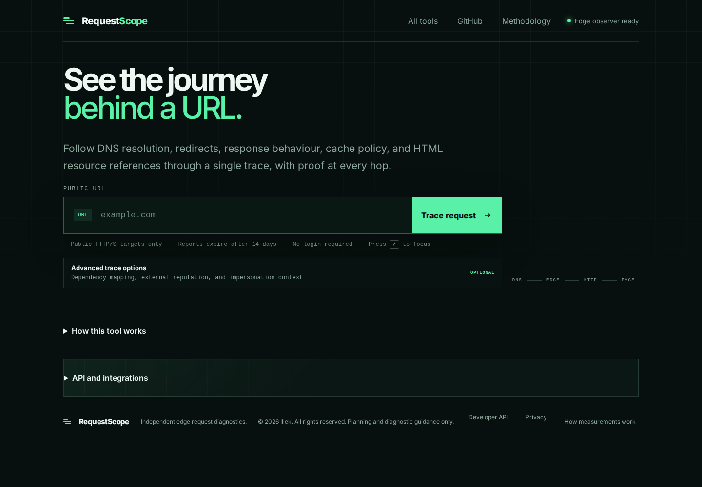
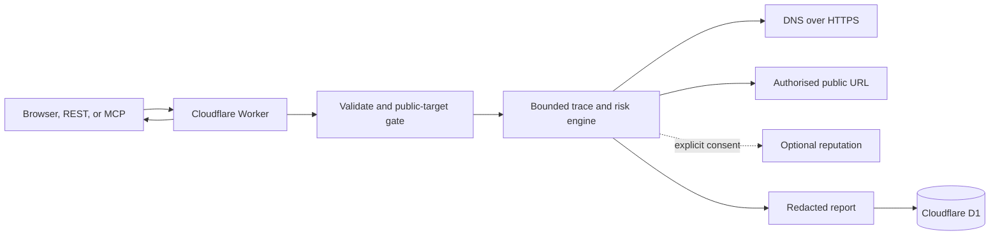

# RequestScope

See where a URL leads and what happens along the way. Inspect DNS answers,
redirects, HTTP responses and URL risk evidence in one report.

[Open RequestScope](https://requestscope.illek.ie) · [More Illek tools](https://tools.illek.ie)



*Live interface captured on 12 September 2026.*

## Try it

Enter a public URL you own or have permission to inspect and select **Trace request**.
Use the report to understand redirects, response headers and the evidence behind
risk findings. REST and MCP interfaces support the same diagnostic engine.

Observations come from Cloudflare's network. They do not measure your browser's
DNS, TCP or TLS timings, and a risk assessment is not a guarantee of safety.

## Contents

- [Architecture](#architecture)
- [Local development](#local-development)
- [API](#api)
- [MCP for Copilot and ChatGPT agents](#mcp-for-copilot-and-chatgpt-agents)
- [Privacy, retention, and quotas](#privacy-retention-and-quotas)

## Architecture



The Worker never claims to measure browser DNS, TCP, or TLS timings. HTTP
timings are observations from Cloudflare's network. DNS results are separate
DNS-over-HTTPS observations. Browser rendering is a planned, separately
labelled observation mode.

See [ARCHITECTURE.md](ARCHITECTURE.md), [SECURITY.md](SECURITY.md), and
[PLAN.md](PLAN.md).

## Local development

```bash
npm install
npm run typecheck
npm test
cd api && npx wrangler dev --local --persist-to ../.wrangler/state
```

Serve `web/` with any static web server and set its API endpoint in
`web/config.js`. Production `ALLOWED_ORIGINS` is only `https://requestscope.illek.ie`.
If that separately served local UI calls a `wrangler dev` API, pass loopback
origins for that session only:

```bash
cd api && npx wrangler dev --local --persist-to ../.wrangler/state \
  --var ALLOWED_ORIGINS:https://requestscope.illek.ie,http://localhost:8788,http://127.0.0.1:8788
```

## API

```text
GET  /api/health
GET  /api
POST /api/scans       {"url":"https://example.com","externalReputation":false}
POST /api/scans/stream  NDJSON progress stream and final report
POST /api/v1/url-risk {"url":"https://example.com","claimedOrganisation":"Microsoft","messageContext":"Password reset email"}
POST /mcp              Streamable HTTP MCP (also available at /mcp/v2)
GET  /api/scans/:id
GET  /api/scans/:id/export
```

Read endpoints also answer HEAD probes (`curl -I` health checks) with the GET
headers and no body.

Request bodies are strict: fields outside the published schemas are rejected
with a `400` naming the field, matching the `additionalProperties: false`
declarations in the OpenAPI contract. Known endpoints answer unsupported
methods with `405` and an `Allow` header instead of a generic `404`. Browser
integrations can read `ETag`, `Location`, `Retry-After`, and
`Content-Disposition` from cross-origin responses because they are listed in
`Access-Control-Expose-Headers`; the web client itself uses this to revalidate
share links in-session without re-downloading report bodies.

Streamed traces are validated and metered before any byte is streamed: invalid
targets answer `400`, disallowed origins or non-public targets `403`, and
exhausted quotas `429` with `Retry-After`. Only failures discovered mid-trace
(inconclusive DNS resolution, blocked redirects, budget exhaustion) arrive
in-band as NDJSON error events.

Traces observe through one of two fixed request identities, selected with the
boolean `mobileUserAgent` field on `/api/scans`, `/api/scans/stream`,
`/api/v1/url-risk`, and the MCP trace and risk tools. The default `desktop`
profile identifies as `RequestScope/1.0 (+https://requestscope.illek.ie)`; the
`mobile` profile identifies as mobile Safari so device-specific pages can be
compared — a common cloaking behaviour in phishing kits. The chosen profile is
recorded as `observation.deviceProfile` in the stored report, and callers can
never supply a literal User-Agent value. DNS and reputation stages are
identical under both profiles.

`POST /api/v1/url-risk` is the stable, compact integration contract for
Microsoft Copilot custom connectors and other automation. It follows redirects
and returns a low, medium, or high assessment with scored evidence for URL
structure, shorteners, cross-domain redirects, Unicode and brand lookalikes,
known service ownership, password/forms, and sensitive-action language. Raw
HTML and raw message context are never returned to the agent. See
[`web/openapi.yaml`](web/openapi.yaml) for the connector definition.

MCP and `POST /api/v1/url-risk` are **intentionally open for testing**. They do
not require `COPILOT_API_KEY`. Abuse is mitigated by durable hashed daily
limits and safer defaults (see below), not by mandatory Bearer auth. Set
`COPILOT_API_KEY` only when you want a later, gated MSP/Copilot deployment;
both interfaces then require `Authorization: Bearer ...`. Until that secret is
set, treat the public hostname as a rate-limited test surface, not a tenant
boundary.

A low assessment means that RequestScope did not observe strong indicators; it
does not certify that a URL is safe. External reputation is opt-in because the
original and final URL are sent to Google Web Risk and PhishTank. Only provider,
status, hostname, threat categories, timestamps, and attribution are retained;
raw provider responses and unredacted URLs are not stored in reports.

Cloudflare's 1.1.1.1 for Families malware resolver is also available as a
supplementary domain-level signal. It receives only the requested and final
hostnames over DNS-over-HTTPS, never the full URL or query string.

Configure providers as Worker secrets after accepting their terms:

```bash
cd api
npx wrangler d1 execute requestscope --remote --file schema.sql
npx wrangler secret put GOOGLE_WEB_RISK_API_KEY
npx wrangler secret put PHISHTANK_APP_KEY
cd ..
npm run deploy:api
```

The deploy command refuses a dirty working tree and binds the current 12-character
git revision as `SOURCE_REVISION`. Use `npm run deploy:api -- --dry-run` to inspect
the Worker bundle and bindings without publishing it.

After deployment, run the complete read-only release check from the released commit:

```bash
npm run smoke:production -- --report-id <non-sensitive-report-id>
```

The check requires Lighthouse on `PATH`. It verifies that `/api/health` reports the
current commit, checks the MCP security headers, and exercises the home, privacy,
and optional report pages at 390, 768, and 1440 pixels. It also checks console and
request failures, horizontal overflow, axe accessibility results, and Lighthouse
release thresholds. Use `--revision <git-revision>` only when verifying an older
release. Use `--skip-lighthouse` only for a partial diagnostic run.

PhishTank currently permits API calls without an application key, but assigns a
lower provider-side request limit. Set `PHISHTANK_KEYLESS_ENABLED = "true"` and
use a conservative `PHISHTANK_DAILY_LIMIT` when registration is unavailable.
An application key, when available, automatically replaces keyless mode.
Verify keyless access from the deployed Worker before leaving it enabled;
PhishTank may apply an automated browser challenge unless the request uses its
documented `phishtank/<identifier>` User-Agent form.

Google Web Risk Lookup has an application-enforced default ceiling of 90,000
requests per calendar month, below its 100,000-request free allowance.
PhishTank has a separate application-enforced daily ceiling. Provider results are
cached, and only the submitted and final URL are eligible for lookup.

The UI also offers a separate public deep-scan handoff to Cloudflare Radar. It
does not submit automatically and warns that Cloudflare retains scan reports
and may make them public.

## MCP for Copilot and ChatGPT agents

The Worker exposes a stateless Streamable HTTP MCP server at:

```text
https://requestscope.illek.ie/mcp
https://requestscope.illek.ie/mcp/v2
```

Both URLs expose `trace_request`, `assess_url_risk`, and
`get_requestscope_report`, all backed by exactly the same scan and scoring
engine as the REST endpoint. `/mcp/v2` is a versioned RequestScope alias; the
negotiated MCP protocol version is `2025-11-25`.

Tool calls that carry `params._meta.progressToken` (and accept
`text/event-stream`) receive `notifications/progress` events while the trace
runs, followed by the ordinary JSON-RPC response as the final message event —
the Streamable HTTP pattern for a trace that can take tens of seconds. Calls
without a progressToken keep the single-response JSON behaviour.

- Copilot Studio: import [`web/mcp-copilot.yaml`](web/mcp-copilot.yaml), or enter the
  `/mcp` URL through its MCP onboarding wizard.
- OpenAI Responses API: configure a remote MCP tool with `server_url` set to
  the `/mcp` URL and allow the `assess_url_risk` tool.
- OpenAPI agents/custom connectors: import [`web/openapi.yaml`](web/openapi.yaml) and
  call `/api/v1/url-risk` directly.

MCP and `/api/v1/url-risk` stay reachable without a key so Copilot and other
agents can be tested against the live hostname. They are protected by rate
limits, not by mandatory auth:

- Anonymous UI / REST scans: `DAILY_SCAN_LIMIT` (15).
- MCP tool calls: `MCP_DAILY_LIMIT` (25 — modestly above the UI scan limit so
  an agent can iterate, not a cheaper bulk-trace path). Handshake and
  `tools/list` do not consume quota.
- `trace_request` defaults `mapDependencies` to `false`, matching REST/OpenAPI.
  Enabling the dependency map costs **two** MCP quota units because it performs
  extra JS, Certificate Transparency, and takeover egress.
- Report retrieval: `REPORT_DAILY_LIMIT` (120), charged only after a live
  report row is found.

Set `COPILOT_API_KEY` only before wider MSP use; both interfaces then require
`Authorization: Bearer ...`. Do not treat the open test surface as
authenticated.

The static `web/` application is served directly from the same Worker through
Cloudflare Workers Assets; there is no separate Pages deployment and no root
redirect.

## Privacy, retention, and quotas

Reports expire after 14 days by default. No raw visitor IP address is stored.
Query parameter names are retained for evidence, but their values are redacted
before reports enter D1, responses, exports, or share links. High-entropy or
token-like path segments (reset tokens, UUIDs, JWTs) are replaced with
`[redacted]` as well.

A successful scan may be reused for **five minutes** for the **same hashed
client** and the same observation options. Different callers do not receive
each other's report IDs. Create/stream responses set
`X-RequestScope-Recent-Observation` to `reused` or `fresh`, and a cache hit
includes `reusedRecentObservation: true` on the returned report (not stored
in D1).

Anonymous daily limits (scans, MCP tool calls, and report retrievals) are
durable in D1 and keyed by a one-way hash of the calendar date and client IP,
so repeats cannot reset them by moving between edge locations. Each request
counts against exactly one scope: REST scans against the scan limit, MCP tool
calls against `MCP_DAILY_LIMIT`, report retrievals against
`REPORT_DAILY_LIMIT`. A repeat scan of a recently traced URL still counts
against the daily scan limit even when the cached result is returned.

The site owner can exempt trusted source IPs from scan and MCP scan limits by
setting the `RATE_LIMIT_BYPASS_IPS` Worker secret to a comma-separated list.
This value must never be placed in `wrangler.toml`; report retrieval limits and
all upstream provider quotas still apply.

## Feedback and contributions

Found a problem? [Report a bug](https://github.com/koya-illek/requestscope/issues/new?template=bug_report.md).
See [CONTRIBUTING.md](CONTRIBUTING.md) for fixes and feature proposals, or
[SECURITY.md](SECURITY.md) to report a vulnerability.

## License

MIT © Koya Illek. See [LICENSE](LICENSE).

Live service: [requestscope.illek.ie](https://requestscope.illek.ie).
